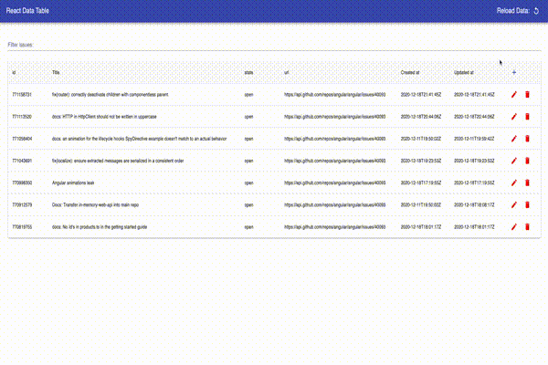

# React Data Table

## Overview

CICCC WAMD React course final project.

Manage issues in material-ui table.

## Member
- Wonjae
- Chihiro
- Afshin

## Functions
- Add / Edit / Delete rows with redux
- Filtering rows with it's title
- Save and get rows from localstorage
